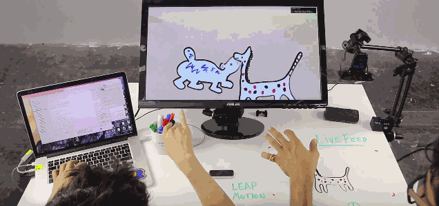
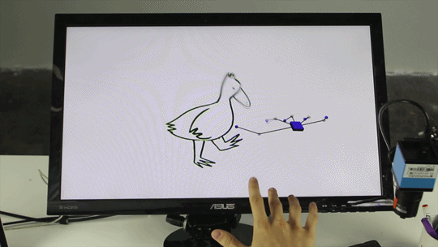

# dranimate

Instructions:

1.  install the following ofx addons before trying to compile: 
<a href="https://github.com/ofZach/ofxPuppet">ofxPuppet</a> 
<a href="https://github.com/Bryce-Summers/ofxButterfly">ofxButterfly</a> 
<a href="https://github.com/ofZach/ofxTriangleMesh">ofxTriangleMesh</a> 
<a href="https://github.com/kylemcdonald/ofxCv">ofxCv</a> 
<a href="https://github.com/ofTheo/ofxLeapMotion">ofxLeapMotion</a> 
<a href="https://github.com/loveandsheep/ofxClickDownMenu">ofxClickDownMenu</a> 
<a href="https://github.com/astellato/ofxSyphon">ofxSyphon</a> 

(Note: you can also use the <a href="https://github.com/golanlevin/ofxPuppet/tree/accelerate">experimental version of ofxPuppet</a> that uses the Accelerate framework for a signifigant performance boost.)

2.  clone this repo, place the "dranimate" folder in ".../of_v0.8.4_osx_release/apps/myApps/"
3.  open the xcode project and compile